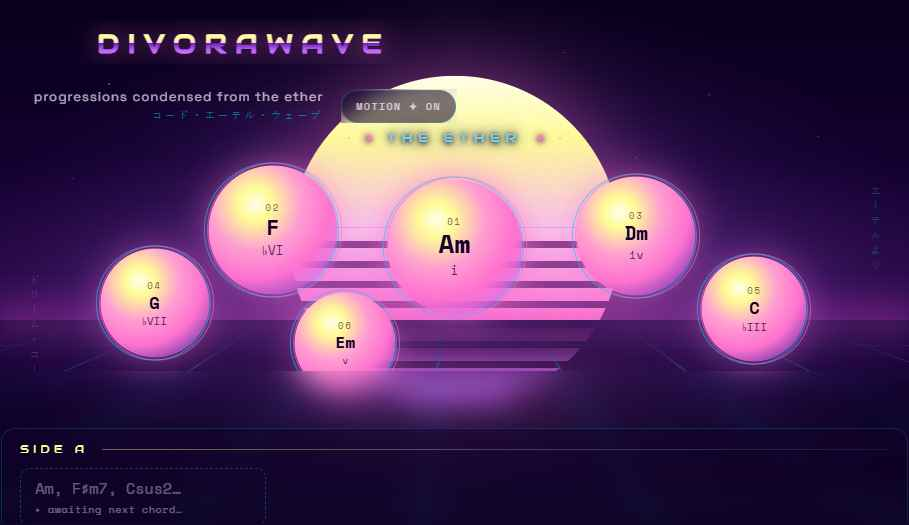

# D I V O R A W A V E

*progressions condensed from the ether*

**Live: https://nicksanft.github.io/divorawave/**

A static single-page web app that helps songwriters conjure synthwave chord progressions. Press **✦ CONJURE** for a loop-shaped 4- or 8-chord progression, or type the chords you already have and watch six ranked next-chord suggestions condense out of a vaporwave dreamscape — each one instantly audible on a real piano soundfont. A hybrid engine (music-theory rules generate candidates, real-song statistics rank them) powers both, with an **Adventurousness** dial that slides suggestions from FM RADIO consensus toward the DEEP ETHER (Neapolitans, tritone substitutes, secondary dominants).

Pure HTML/CSS/JS after a Vite build · GitHub Pages · no backend, no accounts, no API keys.



## How it works

- **Rules layer** (`src/engine/rules.ts`) — a curated functional-harmony candidate table, mode-aware and tuned for synthwave's aeolian center of gravity, each candidate carrying a spice rating from diatonic 0 to tritone-substitute 0.9.
- **Stats layer** (`src/engine/stats.ts` + `public/data/synthwave.transitions.json`) — an order-2 Markov model with order-1/unigram backoff, distilled from the 865 wave-tagged songs in the Chordonomicon corpus. The table only *ranks*; it never proposes a chord the rules layer didn't generate.
- **The blend** (`src/engine/blend.ts`) — roughly `score = (1−a)·P̂stats + a·spice·novelty` with voice-leading smoothness as the tiebreaker; the dial is `a`, eased and scaled (the exact frozen constants live in `blend.ts`).
- **Audio** (`src/audio/`) — smplr's SplendidGrandPiano through a generated noise-decay reverb and a subtle stereo chorus, scheduled by a ~25 ms lookahead loop; an analyser's smoothed RMS drives the `--pulse` CSS variable, so the sunset literally breathes with the music (and stays static under reduced motion).
- **UI** (`src/ui/`) — Preact + signals; every chord is stored dual-natured (absolute spelling *and* key-relative Roman degree), so the notation toggle and key changes are re-renders, never lossy conversions.

## Development

```bash
npm install
npm run dev        # dev server
npm test           # vitest (golden parity vs the Phase A demo engine, calibration, UI smoke, vendoring guards)
npm run build      # type-check + production build
```

The four-state design mockups, binding token sheet, and motion spec that govern the UI live in [`mockup/`](mockup/); the phase-by-phase build plan (with every recorded engineering decision) is [`PLAN.md`](PLAN.md).

### Rebuilding the corpus statistics

```bash
# one-time: fetch the dataset (264 MB — cached, never committed)
mkdir -p tools/.cache
curl -L -o tools/.cache/chordonomicon_v2.csv https://huggingface.co/datasets/ailsntua/Chordonomicon/resolve/main/chordonomicon_v2.csv
npm run distill
```

The distiller filters by a tiered wave-genre regex (tier 1 alone yields ~980 rows), estimates each song's key with a Krumhansl profile match, maps chords to Roman-degree statsIds through the same theory code the app ships, and emits aggregate transition statistics with full provenance. It prints its tier and row counts loudly on every run; the deeper fallback tiers require explicit flags.

## Data & credits

- Corpus statistics are distilled at build time from the **Chordonomicon** dataset ([`ailsntua/Chordonomicon`](https://huggingface.co/datasets/ailsntua/Chordonomicon), CC-BY-NC-4.0). Only aggregate transition statistics ship with the app — no song data.

  ```bibtex
  @article{kantarelis2024chordonomicon,
    title={CHORDONOMICON: A Dataset of 666,000 Songs and their Chord Progressions},
    author={Kantarelis, Spyridon and Thomas, Konstantinos and Lyberatos, Vassilis
            and Dervakos, Edmund and Stamou, Giorgos},
    journal={arXiv preprint arXiv:2410.22046},
    year={2024}
  }
  ```

- Piano: [smplr](https://github.com/danigb/smplr) with the [smpldsnds SplendidGrandPiano](https://github.com/smpldsnds/sfzinstruments-splendid-grand-piano) samples, **vendored first-party** into `public/samples/` (both ogg and m4a; re-vendor with `npm run vendor:samples`) · Music theory: [tonal](https://github.com/tonaljs/tonal).
- Fonts (Audiowide, Space Grotesk, Space Mono — OFL-licensed) are likewise vendored into the bundle (`npm run vendor:fonts`). The deployed site makes **no third-party requests at runtime** on the normal path — the piano's emergency fallback retries a third-party soundfont CDN only if our own origin fails to serve samples. Redistribution details in [THIRD_PARTY_NOTICES.md](THIRD_PARTY_NOTICES.md).
- All visuals are original, generated CSS/SVG — vaporwave the language, not any specific artwork.
- Built with [Claude Code](https://claude.com/claude-code).

## License

MIT for the code in this repository (see [LICENSE](LICENSE)). The Chordonomicon dataset itself is CC-BY-NC-4.0 — this project is free and non-commercial; a future commercial use would need to revisit that dependency.
